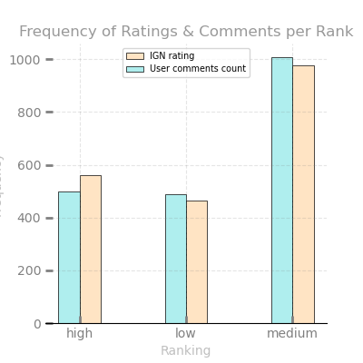
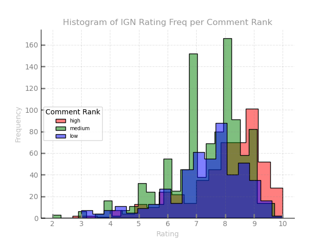
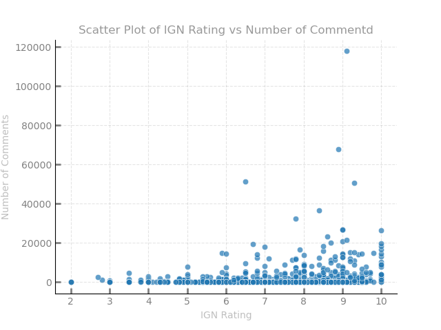

</img>

# Imagine Game Network (IGN) Game Review Legitimacy

 **Over the years, gamers have revered IGN as one of the foremost experts in gaming and entertainment. Frankly, if you have played a console or PC game, you have heard of IGN. Todays' question is: whether IGN Rating *("game reviews ratings")* has any impact on user conversation *(number of comments)*?**

[Explore with tableau](https://public.tableau.com/profile/marketne#!/vizhome/IGNGameReview/Dashboard1?publish=yes)

<details>
<summary>Hypothesis</summary>

    [H0] Higher-rated games do not have more conversations. 
    [H1] Higher-rated games have more conversations. 

</details>

## Data

Data is taken [*aka scrape*](src/webscrapper.py) from [IGN Game Reviews](https://www.ign.com/reviews/games) and is as followed:

    1. Game Name 
    2. IGN game review rating
    3. Date of rating
    4. Number of comments 

### Overview 

|Variable|# Missing|Imputed As|# of Observations |
|:--------|:----------|:-------|:-------------|
|Rating|0||1999|
|Date|0||1999|
|Comment Count|246|0|1999|
|Name|0||1999|


#### Created Variables

```bash
├── Date
│   ├── month           (int)
│   └── year            (int)
├── Name
│   └── console         (str)
├── Rating
│   └── rate rank       (str 3 levels)
└── Comment Count
    └── comment rank    (str 3 levels)
```

<p style= "color: grey"> 

Games Reviewed|# Rating and Comments
:-:|:-:
</img>|</img>

</p>

## Testing

<details>

<summary>Mann-Whitney & Spearman</summary>

---
>Mann-Whitney U Test compares two independent groups when the dependent variable is either ordinal or continuous but not normally distributed.

    Assumptions: 
        1. The dependent variable is ordinal or continuous.
        2. The Independent variable is two categorically independent groups.
        3. Observations are independent.
        4. Dataset is not normally distributed.
---
> The Spearman rank-order correlation coefficient is a nonparametric measure of the monotonicity of the relationship between two datasets. Unlike the Pearson correlation, the Spearman correlation does not assume that both datasets are normally distributed.

    Correlation Levels:
        Perfect :   near ± 1
        Strong  :   between ± 0.50 and ± 1
        Medium  :   between ± 0.30 and ± 0.49
        Small   :   below + .29
        None    :   value is zero

---

```python
# In python 
import scipy.stats as stats

stats.mannwhitneyu(x, y)    # Mann Whitney
stats.spearmanr(x, y)       # Spearman 
```

---
</details>

> The significance level is 0.05, and any p-values low will be statistically significant to this project.

We would like to test a few assumtions:

*Comment Ranks*

    1. Low rating vs Medium rating comment count
    2. Low rating vs High rating comment count
    3. Medium rating vs High rating comment count

<p align="center"></p>

*Comment Count and IGN Rating*

    4. Number of Comments vs IGN Rating. 

<p align="center"></p>


## Conclusion

<details>

<summary>Mann-Whitney Test: Null rejected for low vs high and high vs medium. Null accepted for low vs medium. </summary>

||low vs high| low vs medium| medium vs high|
|-|-----------|--------------|---------------|
|**Comment Ranks**|0.00|<font color = 'red'>0.23</font>|0.00|

</details>

<details>

<summary>Spearman: Null rejected for IGN rating vs the number of comments. There is a small degree of correlation between the two variables.</summary>

||pvalue|cor-coef|
|-|--------------|---------------|
|**Comment Counts vs Rating**|0.00|<font color = 'orange'>0.19</font>|

</details>

>**Inconclusion** it appears that there is a relation between IGN game review rating and user conversations about said games.

---

---

<details>

<summary> Data Dictionary</summary>

|Variable|Data Type|Defined As|
|:--------|:----------|:-------|
|Rating|float|IGN Reviewer Rating|
|Date|date|date formate(year-month-day)|
|Comment Count|int|Number of comments on review|
|Name|string|Game name|
|Month|int|Month in numeric|
|Year|int|Year in numeric|
|Console|string|Console game was reviewed on|
|Rate Rank|string|low (> 6.8), medium (6.8 - 8.5), high (< 8.5)|
|Comment Rank|string|low (> 36), medium (36 - 670), high (< 670)|

</details>
