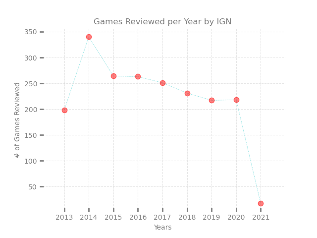

# Imagine Game Network (IGN) Game Review Legitimacy

 **Over the years, gamers have revered IGN as one of the foremost experts in gaming and entertainment. Frankly, if you have played a console or PC game, you have heard of IGN. So, how accurate is IGN with their *"game reviews"*?**

## Data

Data is taken *aka scrapped* from [IGN Game Reviews](https://www.ign.com/reviews/games) and is as followed:

    1. Game Name 
    2. IGN game review rating
    3. Date of rating
    4. Number of comments 

<h2 align = "center" color = "grey"> What we got </h2>

</img>

---

---

## Data Dictionary

|Variable|Data Type|Defined As|
|:--------|:----------|:-------|
|Rating|float|IGN Reviewer Rating|
|Date|date|date formate(year-month-day)|
|Comment Count|int|Number of comments on review|
|Name|string|Game name|
|Month|int|Month in numeric|
|Year|int|Year in numeric|
|Console|string|Console game was reviewed on|
|Rate Rank|string|low (> 6.8), medium (6.8 - 8.5), high (< 8.5)|
|Comment Rank|string|low (> 36), medium (36 - 670), high (< 670)|
