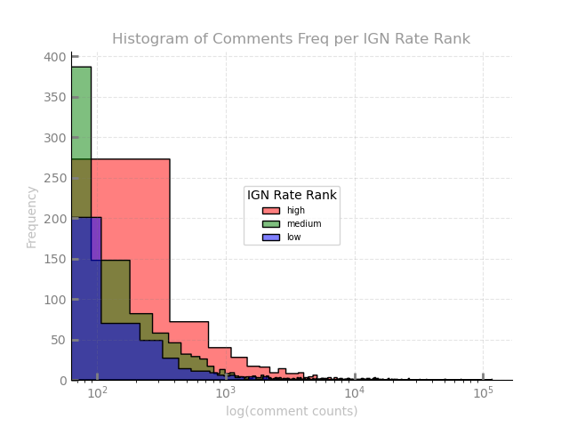

# Imagine Game Network (IGN) Game Review Legitimacy

 **Over the years, gamers have revered IGN as one of the foremost experts in gaming and entertainment. Frankly, if you have played a console or PC game, you have heard of IGN. Todays' question is: whether IGN Rating *("game reviews ratings")* has any impact on user conversation *(number of comments)*?**

<details>
<summary>Hypothesis</summary>

    [H0] Higher-rated games have more conversations. 
    [H1] Higher-rated games do not have more conversations. 

</details>

## Data

Data is taken [*aka scrape*](src/webscrapper.py) from [IGN Game Reviews](https://www.ign.com/reviews/games) and is as followed:

    1. Game Name 
    2. IGN game review rating
    3. Date of rating
    4. Number of comments 

### Overview 

|Variable|# Missing|Imputed As|# of Observations |
|:--------|:----------|:-------|:-------------|
|Rating|0||1999|
|Date|0||1999|
|Comment Count|246|0|1999|
|Name|0||1999|


### Created Variables

```bash
├── Date
│   ├── month           (int)
│   └── year            (int)
├── Name
│   └── console         (str)
├── Rating
│   └── rate rank       (str 3 levels)
└── Comment Count
    └── comment rank    (str 3 levels)
```

<h3 align = "center" color =grey> What we got </h3>

Games Reviewed|# Rating and Comments
:-:|:-:
</img>|</img>

## Testing

<details>

<summary>The Mann-Whitney U test is used to conduct the hypothesis testings. </summary>

__Mann-Whitney U Test__ compares two independent groups when the dependent variable is either ordinal or continuous but not normally distributed.

<u>Assumptions</u>

1. The dependent variable is ordinal or continuous.
2. The Independent variable is two categorically independent groups.
3. Observations are independent.
4. Dataset is not normally distributed.

</details>

The significance level is 0.05, and any p-values low will be statistically significant to this project.

We would like to know the significance of 6 items:

*IGN Rankings*

1. Low rating vs Medium rating comment count
2. Low rating vs High rating comment count
3. Medium rating vs High rating comment count
   
<p align="center"></p>

*Comment Ranking*

4. Low rating vs Medium rating comment count
5. Low rating vs High rating comment count
6. Medium rating vs High rating comment count


<p align="center"></p>

## Results 


---

---


## Data Dictionary

|Variable|Data Type|Defined As|
|:--------|:----------|:-------|
|Rating|float|IGN Reviewer Rating|
|Date|date|date formate(year-month-day)|
|Comment Count|int|Number of comments on review|
|Name|string|Game name|
|Month|int|Month in numeric|
|Year|int|Year in numeric|
|Console|string|Console game was reviewed on|
|Rate Rank|string|low (> 6.8), medium (6.8 - 8.5), high (< 8.5)|
|Comment Rank|string|low (> 36), medium (36 - 670), high (< 670)|
